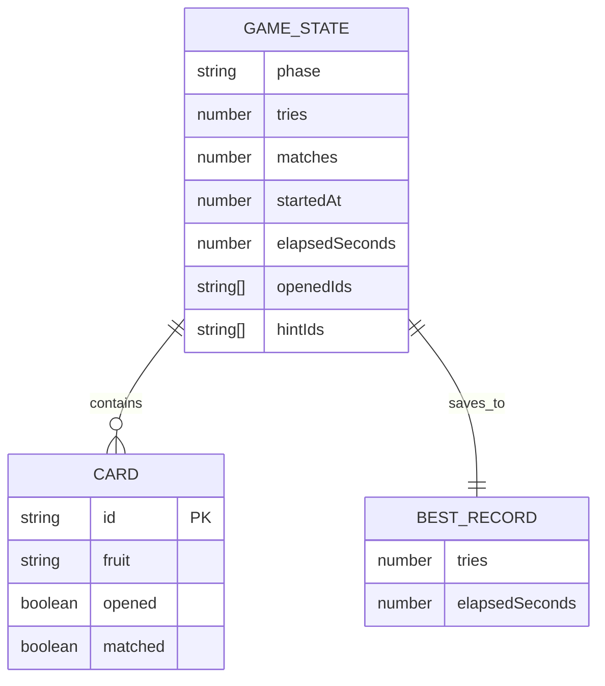
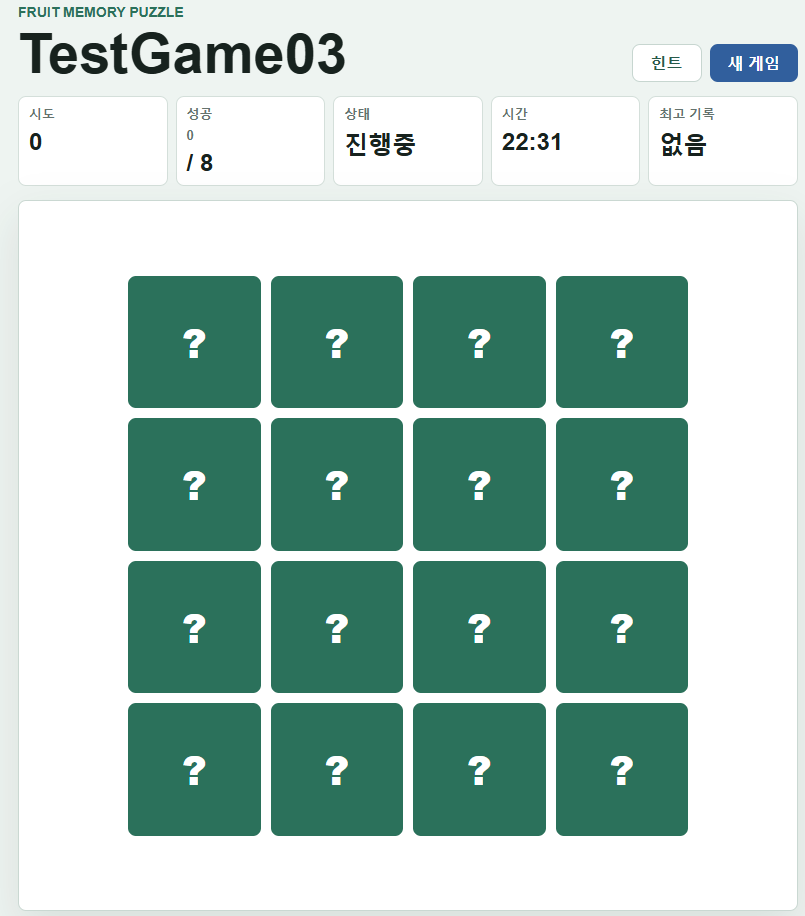

# puzzle-game

이 프로젝트는 초등학생도 쉽게 즐길 수 있는 카드 짝 맞추기 퍼즐 게임입니다. 아래 내용은 게임이 어떻게 동작하는지, 데이터가 어떻게 만들어지고 흐르는지를 쉽게 설명한 내용입니다.

## 1. 게임 전체 흐름

1. 페이지가 열리면 `js/app.js`에서 기본 화면과 상태를 만든 후 게임을 시작합니다.
2. `js/game.js`에서 카드 16장을 만들어서 섞습니다.
3. 플레이어가 카드를 클릭하면 게임 상태가 바뀌고 화면이 다시 그려집니다.
4. 두 장을 열면 같은 카드인지 검사하고 맞으면 맞힌 카드로 처리, 틀리면 다시 뒤집습니다.
5. 모든 카드를 맞추면 게임이 종료되고 기록이 저장됩니다.

## 2. 데이터는 어떻게 만들어지나요?

게임 데이터는 `state`라는 큰 상자에 모두 들어가 있습니다. 이 상자는 `js/game.js`의 `createInitialState()`에서 만듭니다.

- `phase`: 게임 단계
  - READY, PLAYING, RESOLVING, HINTING, CLEARED
- `cards`: 카드 목록
- `openedIds`: 지금 열려 있는 카드의 ID들
- `hintIds`: 힌트로 잠깐 보여주는 카드의 ID들
- `tries`: 시도 횟수
- `matches`: 맞춘 쌍 개수
- `startedAt`: 게임 시작 시간
- `elapsedSeconds`: 경과 시간

### 카드 데이터 생성

`js/game.js`의 `createDeck()` 함수는 다음을 합니다:

- `CONFIG.fruits`에 있는 과일 8개를 가져옵니다.
- 각 과일을 같은 모양 두 장씩 만들어서 총 16장으로 만듭니다.
- 각 카드에는 `id`, `fruit`, `opened`, `matched`가 들어갑니다.

카드 하나의 예:

- `id`: 고유 식별자
- `fruit`: 과일 그림(예: 🍎)
- `opened`: 현재 열려 있는지 여부
- `matched`: 이미 짝이 맞았는지 여부

### 카드 섞기

`js/utils.js`의 `shuffle()` 함수가 카드 순서를 무작위로 바꿉니다.

## 3. 클릭할 때 데이터는 어떻게 변하나요?

1. 사용자가 카드 버튼을 클릭하면 `js/app.js`에서 `OPEN_CARD` 액션이 실행됩니다.
2. `js/game.js`의 `openCard()`가 선택된 카드를 열고 `openedIds`에 ID를 추가합니다.
3. 두 장을 열면 `tries`가 1 증가하고, `phase`는 `RESOLVING`으로 바뀝니다.

## 4. 두 장을 비교하는 과정

- 열린 카드 두 장을 찾아서(`getOpenedCards()`)
- 과일 모양이 같은지 검사합니다(`isPair()`)

### 맞으면
- `resolveMatch()`가 실행되며 두 카드를 `matched: true`로 바꿉니다.
- `matches`가 1 올라갑니다.
- 모든 쌍을 맞추면 `phase`는 `CLEARED`가 됩니다.

### 틀리면
- `resolveMismatch()`가 실행되어 열린 카드 두 장을 다시 `opened: false`로 되돌립니다.
- `openedIds`를 빈 배열로 초기화하고 `phase`를 `PLAYING`으로 되돌립니다.

## 5. 힌트 기능

- 플레이 중에 `SHOW_HINT` 버튼을 누르면 `findHintPair()`가 아직 맞추지 않은 카드 중에서 같은 과일 두 장을 찾습니다.
- 찾으면 `hintIds`에 저장하고 `phase`를 `HINTING`으로 바꿉니다.
- 잠시 후 자동으로 `HIDE_HINT`가 되어 힌트가 사라집니다.

## 6. 기록 저장

`js/storage.js`에서 최고 기록을 `localStorage`에 저장합니다.

- `loadBestRecord()`: 저장된 최고 기록을 불러옵니다.
- `saveBestRecord()`: 현재 기록이 더 좋으면 저장합니다.
- 기록은 시도 횟수와 시간으로 비교합니다.

## 7. ER 다이어그램

## 8. 쉽게 정리하면

- 게임은 `state`라는 큰 데이터 상자 하나로 관리됩니다.
- 카드는 16개를 만들고 섞은 뒤, 클릭할 때마다 상태를 바꿉니다.
- 맞추기/틀리기, 힌트, 시간, 기록 저장 모두 이 상태 데이터로 처리됩니다.
- 그래서 코드를 보면 거의 모든 동작이 `state`를 바꾸고 화면을 다시 그리는 방식입니다.

## 실행화면

## 9. 6x6 난이도와 빙고 기능

이번 버전에서는 보드 크기를 6x6으로 사용하며, 총 36장의 카드와 18개의 과일 쌍을 맞추는 방식으로 난이도를 높였습니다.

빙고 기능은 다음 규칙으로 동작합니다.

1. 한 행에 있는 카드 6장이 모두 매칭 완료되면 빙고가 됩니다.
2. 빙고가 처음 완성된 행에 대해서만 메세지 박스가 표시됩니다.
3. 메세지 박스에서 확인을 누르면 게임이 즉시 종료됩니다.
4. 취소를 누르면 게임은 계속 진행됩니다.
5. 이미 빙고로 확인한 행은 다시 같은 메세지를 띄우지 않습니다.

관련 로직은 `js/game.js`의 `findNewBingoRows()`에서 새 빙고 행을 찾고, `js/app.js`의 `handleBingo()`에서 종료 여부를 묻는 방식으로 처리합니다.

## 10. 추가 변경 사항

### 게임 이름

게임 이름을 `Puzzle Game`으로 변경했습니다. 브라우저 탭 제목과 화면 상단의 제목 모두 같은 이름을 사용합니다.

### 무작위 힌트

힌트 버튼을 누르면 아직 맞추지 않은 카드 중에서 맞출 수 있는 쌍을 무작위로 하나 선택해서 보여줍니다. 기존처럼 앞에서부터 순서대로 찾지 않고, 가능한 힌트 후보 중 랜덤으로 표시합니다.

힌트는 3초 동안 표시된 뒤 자동으로 닫힙니다.

### 제한시간 모드

`제한시간` 버튼을 누르면 1분 제한시간이 시작됩니다. 제한시간이 켜져 있는 동안 버튼 이름은 `중지`로 바뀝니다.

- 제한시간이 켜지면 점수판에 남은 시간이 표시됩니다.
- `중지` 버튼을 누르면 제한시간이 꺼지고 남은 시간 표시가 `없음`으로 돌아갑니다.
- 제한시간이 0초가 되면 게임이 종료됩니다.

관련 로직은 `js/game.js`에서 제한시간 상태를 관리하고, `js/app.js`의 `toggleTimeLimit()`과 `updateTimeLimit()`에서 버튼 동작과 카운트다운을 처리합니다.
