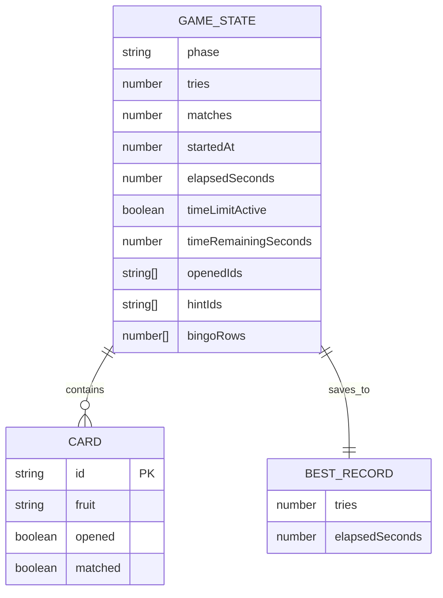
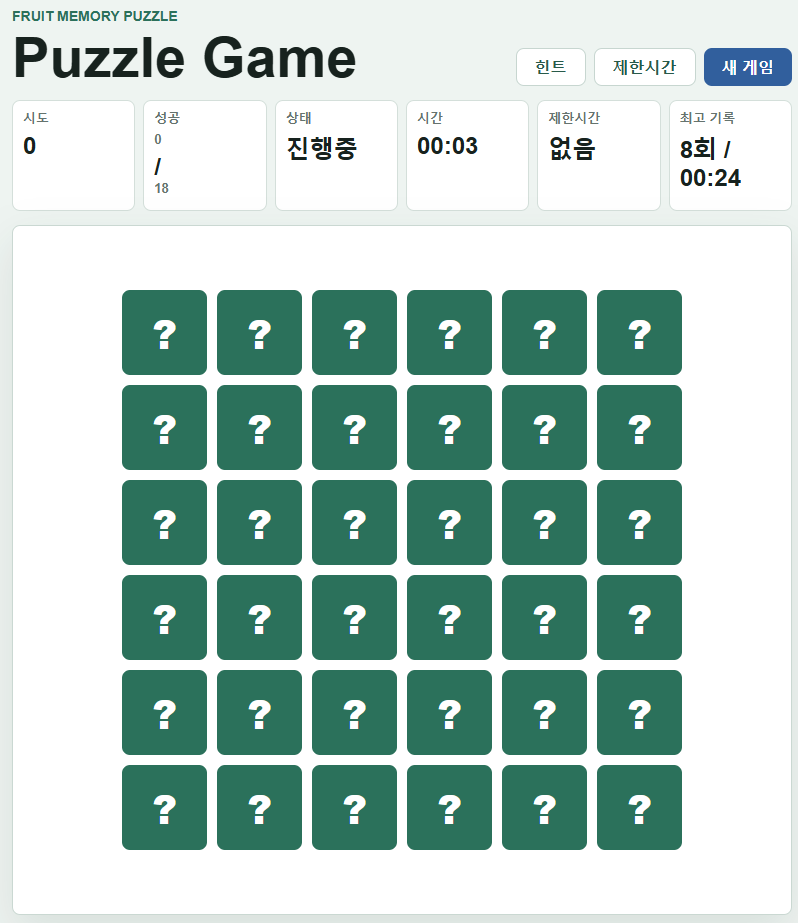

# Puzzle Game

초등학생도 쉽게 즐길 수 있는 과일 카드 맞추기 퍼즐 게임입니다. 현재 버전은 6x6 보드, 무작위 힌트, 빙고 종료 선택, 1분 제한시간 모드를 제공합니다.

## 1. 게임 흐름

1. 페이지가 열리면 `js/app.js`에서 초기 상태를 만들고 새 게임을 시작합니다.
2. `js/game.js`에서 18개의 과일 쌍으로 총 36장의 카드를 만들고 무작위로 섞습니다.
3. 플레이어가 카드를 클릭하면 `OPEN_CARD` 액션으로 선택한 카드가 열립니다.
4. 카드 2장이 열리면 시도 횟수가 1 증가하고, 두 카드의 과일이 같은지 확인합니다.
5. 같은 과일이면 매칭 완료 카드가 되고, 다르면 잠시 후 다시 닫힙니다.
6. 모든 과일 쌍을 맞추면 게임이 클리어되고 최고 기록을 저장합니다.

## 2. 주요 상태 데이터

게임 상태는 `js/game.js`의 `createInitialState()`에서 만드는 `state` 객체로 관리합니다.

- `phase`: 게임 단계입니다. `READY`, `PLAYING`, `RESOLVING`, `HINTING`, `CLEARED`, `ENDED` 값을 사용합니다.
- `cards`: 카드 목록입니다.
- `openedIds`: 현재 열려 있는 카드 ID 목록입니다.
- `hintIds`: 힌트로 잠시 보여주는 카드 ID 목록입니다.
- `bingoRows`: 이미 빙고 메세지를 확인한 행 번호 목록입니다.
- `tries`: 카드 2장을 열어 비교한 시도 횟수입니다.
- `matches`: 맞춘 과일 쌍 개수입니다.
- `startedAt`: 게임 시작 시간입니다.
- `elapsedSeconds`: 경과 시간입니다.
- `timeLimitActive`: 제한시간 모드가 켜져 있는지 나타냅니다.
- `timeRemainingSeconds`: 제한시간 모드에서 남은 시간입니다.

## 3. 카드 구성

카드 구성은 `js/utils.js`의 `CONFIG`와 `js/game.js`의 `createDeck()`에서 결정됩니다.

- 보드 크기: 6x6
- 총 카드 수: 36장
- 과일 쌍: 18쌍
- 각 카드는 `id`, `fruit`, `opened`, `matched` 값을 가집니다.
- 게임을 시작할 때 `shuffle()`로 카드 순서를 섞습니다.

## 4. 카드 클릭과 매칭

카드를 클릭하면 `js/app.js`에서 `OPEN_CARD` 액션을 보냅니다. `openCard()`는 클릭한 카드를 열고 `openedIds`에 카드 ID를 추가합니다.

카드 2장이 열리면 `RESOLVING` 단계가 됩니다. 이때 `isPair()`로 두 카드의 과일이 같은지 확인합니다.

- 맞으면 `resolveMatch()`가 두 카드를 `matched: true`로 바꾸고 `matches`를 1 올립니다.
- 틀리면 `resolveMismatch()`가 두 카드를 다시 닫습니다.
- 모든 쌍을 맞추면 `phase`가 `CLEARED`로 바뀌고 게임이 완료됩니다.

## 5. 무작위 힌트

힌트 버튼을 누르면 `SHOW_HINT` 액션이 실행됩니다.

`findHintPair()`는 아직 맞추지 않았고 열려 있지 않은 카드 중에서 맞출 수 있는 쌍을 모은 뒤, 그중 하나를 무작위로 선택합니다. 선택된 카드 2장은 `hintIds`에 저장되어 화면에 잠시 표시됩니다.

힌트는 3초 동안 표시되고, 이후 `HIDE_HINT` 액션으로 자동 닫힙니다. 힌트가 표시 중이거나 카드가 이미 열려 있을 때는 힌트 버튼을 사용할 수 없습니다.

## 6. 빙고 기능

빙고는 6x6 보드에서 하나의 행에 있는 카드 6장이 모두 매칭 완료되었을 때 발생합니다.

`findNewBingoRows()`는 아직 확인하지 않은 행 중 새로 빙고가 된 행을 찾습니다. 빙고가 발생하면 `handleBingo()`가 메세지 박스로 게임 종료 여부를 묻습니다.

- 확인을 누르면 `END_GAME` 액션으로 게임이 종료됩니다.
- 취소를 누르면 게임을 계속 진행합니다.
- 이미 확인한 빙고 행은 `bingoRows`에 기록되어 같은 행으로 다시 묻지 않습니다.

## 7. 제한시간 모드

상단의 `제한시간` 버튼을 누르면 1분 제한시간 모드가 시작됩니다.

- 제한시간이 켜지면 버튼 이름이 `중지`로 바뀝니다.
- 점수판에 남은 시간이 `00:59`처럼 표시됩니다.
- `중지` 버튼을 누르면 제한시간이 꺼지고 표시가 `없음`으로 돌아갑니다.
- 남은 시간이 0초가 되면 `END_GAME` 액션으로 게임이 종료됩니다.
- 새 게임을 시작하면 제한시간 상태도 초기화됩니다.

제한시간 상태는 `js/game.js`에서 관리하고, 실제 카운트다운 갱신은 `js/app.js`의 `toggleTimeLimit()`과 `updateTimeLimit()`에서 처리합니다.

## 8. 기록 저장

최고 기록은 `js/storage.js`에서 `localStorage`에 저장합니다.

- `loadBestRecord()`: 저장된 최고 기록을 불러옵니다.
- `saveBestRecord()`: 현재 기록이 더 좋으면 최고 기록을 저장합니다.
- 기록은 시도 횟수를 먼저 비교하고, 시도 횟수가 같으면 경과 시간이 짧은 쪽을 더 좋은 기록으로 판단합니다.
- 빙고 종료나 제한시간 종료처럼 중간에 끝난 게임은 최고 기록으로 저장하지 않습니다.

## 9. 화면 구성

`index.html`과 `js/board.js`가 화면을 구성합니다.

- 게임 이름은 `Puzzle Game`입니다.
- 상단 버튼은 `힌트`, `제한시간/중지`, `새 게임`입니다.
- 점수판에는 시도 횟수, 성공 쌍 수, 상태, 경과 시간, 제한시간, 최고 기록이 표시됩니다.
- 보드는 `aria-rowcount="6"`과 `aria-colcount="6"`을 사용하는 6x6 그리드입니다.
- 게임을 모두 클리어하면 완료 패널에 최종 시도 횟수와 시간이 표시됩니다.

## 10. ER 다이어그램

## 11. 핵심 정리

- 게임은 `state` 하나를 중심으로 동작합니다.
- 사용자의 클릭은 액션으로 변환되고, `reducer()`가 상태를 바꿉니다.
- 화면은 상태가 바뀔 때마다 `render()`로 다시 그립니다.
- 6x6 보드, 무작위 힌트, 빙고 확인, 제한시간 모드는 모두 같은 상태 관리 흐름 안에서 처리됩니다.

## 실행화면

